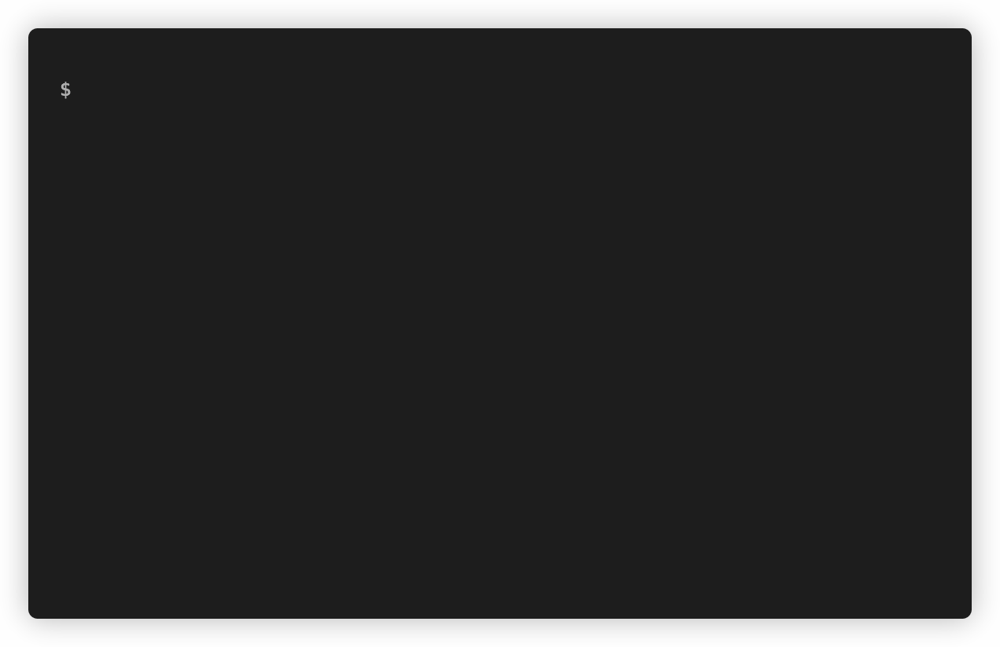

# matter-now

[](https://www.npmjs.com/package/matter-now)
[](https://github.com/rbardini/matter-now/actions)
[](https://libraries.io/npm/matter-now)

Append the current date to the YAML front matter of Markdown files. Useful for adding the published date to static content files like blog posts.



## Installation

```console
npm install -g matter-now
```

## Usage

```console
$ matter-now
Usage: matter-now [options] <file...>

Options:
  -a, --attr <attribute>  front matter attribute (default: "date")
  -f, --format <format>   date-fns date format (default: "yyyy-MM-dd'T'HH:mm:ssxxx")
  -v, --version           output the version number
  -h, --help              display help for command
```

matter-now can also be used with [lint-staged](https://github.com/okonet/lint-staged) to append dates to git staged Markdown files:

```json
{
  "*.md": "matter-now"
}
```

See it in action [here](https://github.com/rbardini/rbardini.com).
